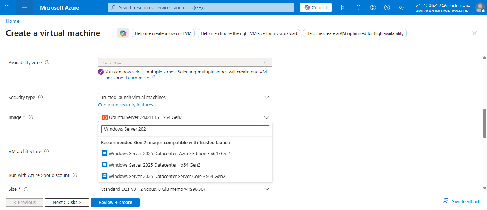
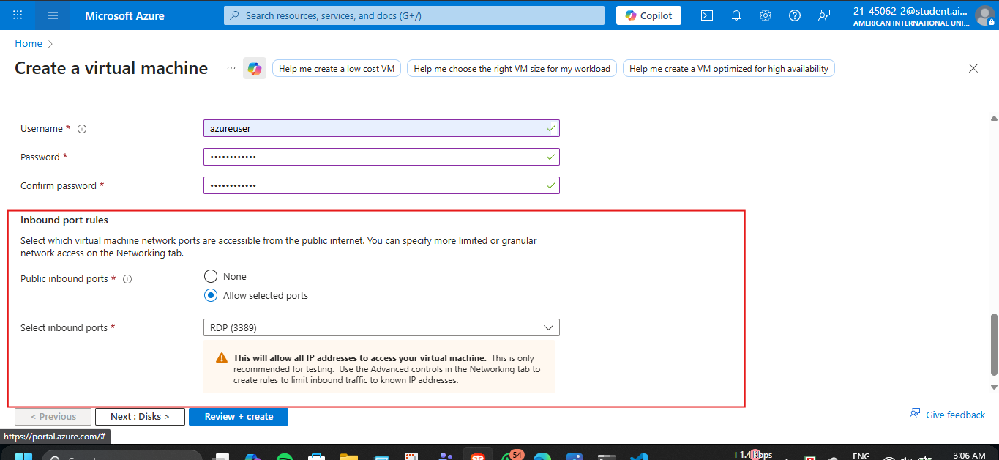
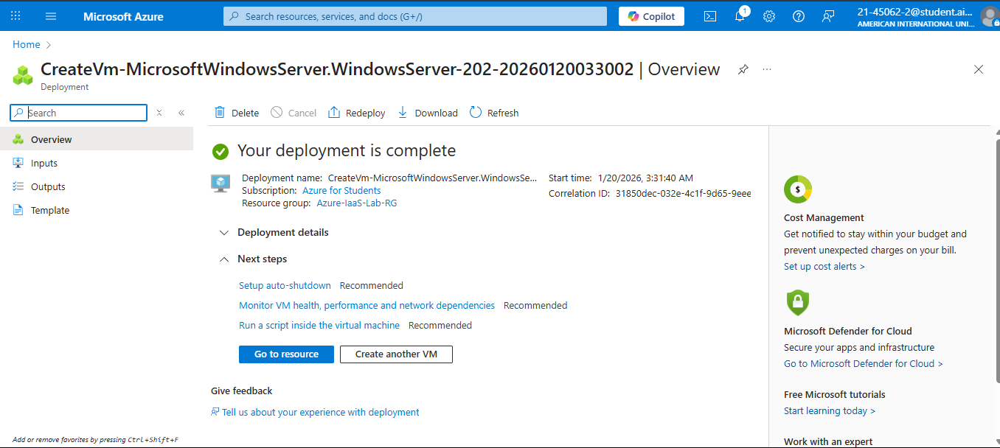
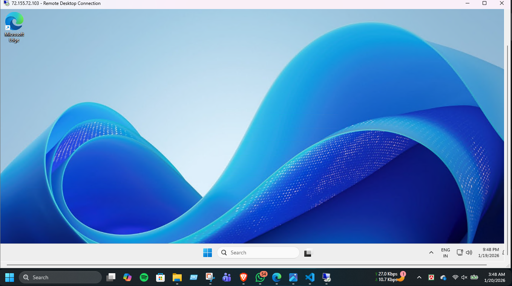

# Project 4: Azure IaaS - Windows Server 2025 Deployment & Administration

## 📌 Project Overview
This project demonstrates the end-to-end provisioning of a **Windows Server 2025** environment on Microsoft Azure using the **Infrastructure-as-a-Service (IaaS)** model. It showcases hands-on expertise in cloud networking, Network Security Group (NSG) configuration, and secure remote administration.

## 🛠️ Infrastructure Specifications
* **Cloud Provider:** Microsoft Azure
* **Operating System:** Windows Server 2025 Datacenter (Azure Edition)
* **VM Size:** Standard D2s v3 (2 vCPUs, 8 GiB RAM)
* **Region:** Korea Central (Zone 2)
* **Storage:** 127 GiB Standard SSD LRS

## 🔐 Remote Access (Live Demo)
For practical evaluation, the instance can be accessed via Remote Desktop Protocol (RDP):
* **Public IP:** `72.155.72.103`
* **Username:** `azureuser`
* **Password:** `Azureuser123`
* **Port:** 3389 (RDP)

> [!IMPORTANT]
> **Cost Optimization Note:** To maximize the utility of the Azure for Students credit, this Virtual Machine is kept in a **'Stopped (Deallocated)'** state when not in use. If you wish to evaluate the live environment or test the RDP connection, please contact me at **mobasherarefint2001@gmail.com** or **21-45062-2@student.aiub.edu**, and I will activate the instance immediately for your review.

## 🚀 Key Technical Implementations

### 1. Secure Networking & NSG Rules
* Configured a custom **Network Security Group (NSG)** to restrict all inbound traffic except for authorized **RDP (Port 3389)** access.
* Implemented a dedicated **Virtual Network (VNet)** and Subnet to ensure isolated compute resources.

### 2. Cloud Governance & Cost Optimization
* Enabled **"Delete public IP and NIC when VM is deleted"** to automate resource cleanup and prevent unused resource billing.
* Utilized **Standard SSD** instead of Premium to optimize Azure for Students credit usage without sacrificing administrative performance.

### 3. Troubleshooting & Policy Alignment
* Successfully resolved `RequestDisallowedByAzure` validation errors by re-mapping resource deployment to policy-compliant regions like **Korea Central**.

## 📂 Project Structure & Evidence
All implementation evidence is stored in the `/screenshots` folder:

### 1. VM Configuration & Specs

*Initial setup of VM Size and OS Image selection.*

### 2. Network Security Rules

*Strict configuration of RDP Port 3389 in NSG.*

### 3. Deployment Status

*Final Azure Resource Manager (ARM) deployment success confirmation.*

### 4. Live Cloud Desktop Access

*Active RDP session into the provisioned Windows Server 2025 instance.*

## 🧠 Core Competencies
* Cloud Resource Provisioning (IaaS)
* Network Security Administration
* Troubleshooting Cloud Policies
* Cost-Efficient Infrastructure Design